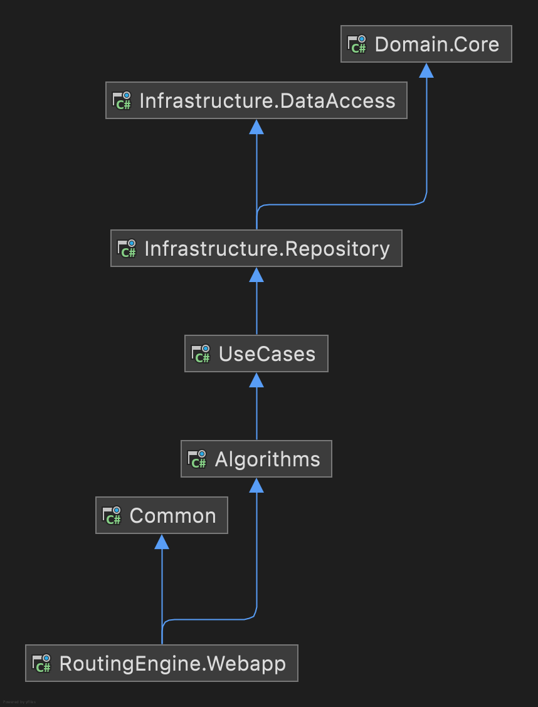

# MaintenanceOpt
<h1> RoutingEngine.WebApp</h1>

This repository is used to solve Vehicle Routing Problem with time windows (VRPTW) using Google OR-Tools. The idea behind this repository is to showcase the principles of clean code and use them in a complex Optimization project.

RoutingEngine.WebApp is the entry point for the algorithm and it has two APIs, one for running the engine and the other for running mapping service to get a distance matrix. The mapping API currently requires an apiKey to connect with the google distance matrix api and writes the full matrix to a csv file. The engine service reads the stops and distance matrix for csv files and writes back the results for route stops to a csv. Both APIs have a swagger integration built to support easy interaction with the API. The data formats can be found in RouteMAX.Webapp/Data.

<h2> Class Design </h2>
The other class libraries are as follows  
1. <b>UseCases</b>                     
2. <b>Infrastructure.Repository</b> 
3. <b>Infrastructure.DataAccess</b> 
4. <b>Algorithms</b> 
5. <b>Domain.Core</b> 
6. <b>Common</b> 

  

The Following design tries to follow very closely with Domain Driven Design Philosophy. Here Domain.Core is independent of any other class library and sits at the center of all dependencies. The Next layers is of Infrastructure used to access Domain and the final layer is of UseCase and Algorithms used to manipulate domain for our purpose.

<h2>Algorithms </h2>
The Algorithm is an integration of Google OR Tools Routing Service. The full documentation for Google OR Tools can be found at <href>https://developers.google.com/optimization/routing</href>.

As constraint Programming will try to find the solution with the number of vehicles specified, the class <b> <a href = "Algorithms/Construction/BuildRoutes.cs"> BuildRoute.cs </a> </b> does an iterative search for the best number of routes by searching between the best known number of vehicles and the highest number for which infeasiblity has been found.

The Duration for each search is set to 300 secs and the first solution strategy is set to Path Cheapest Arc and Local Search MetaHeursitic is set to Guided Local Search. This information can be found in <a href = "Algorithms/GoogleOrToolsSupportClasses/RunGoogleOrOptimization.cs"> RunGoogleOrOptimization.cs </a>

<h2>Retry Policy </h2>
The Distance Matrix service is integrated with a retry policy to handle transient exceptions and retry at a gap of 1,2,4,8,16 and 32 seconds. This retry policy is added by integrating the Polly reseliency framework

<h2>Dependency Injection & Unit Testing </h2>
The use of Interfaces allows us to hide the implementation details from algorithms and usecases.This will allow us to easily mock the behavior of methods and help with unit testing.
